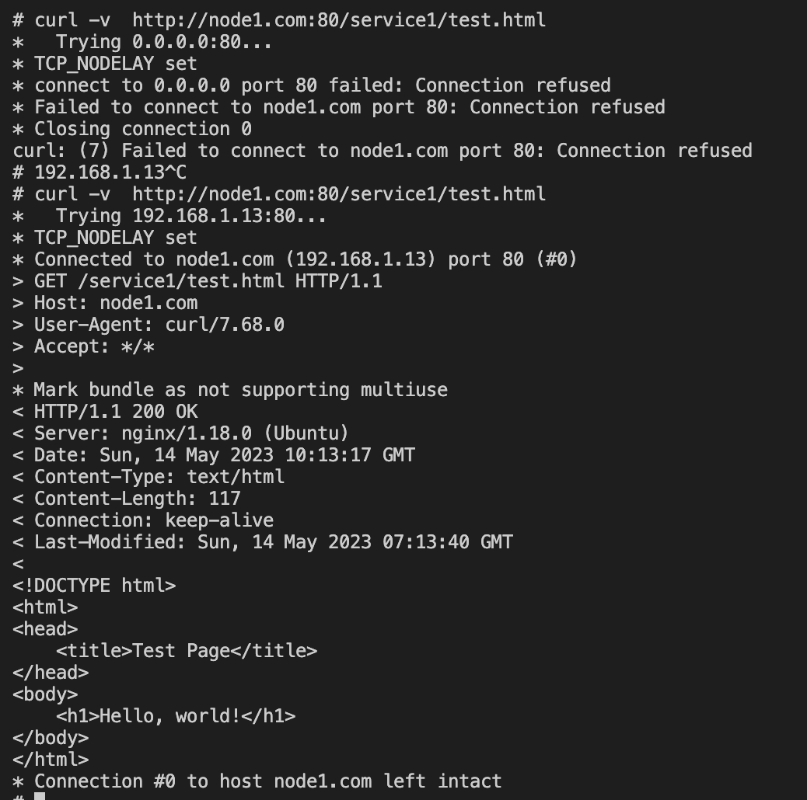

# DNS

## Overview

### 主要功能

Kubernetes中的DNS主要有以下几个功能：

1. 服务发现

Kubernetes中的DNS服务可以帮助应用程序发现其他服务。当应用程序需要访问其他服务时，可以使用服务名称作为DNS记录的别名，而不需要知道服务的IP地址和端口号。在Kubernetes集群中，每个Service对象都有一个DNS记录，可以通过服务名称访问到。

2. 域名解析

Kubernetes中的DNS服务可以解析不同对象的域名，包括服务、Pod和ServiceAccount等。这使得在集群内部通信时，不需要使用硬编码的IP地址和端口号，而可以使用相应对象的DNS名称。

3. 集群内部DNS解析

Kubernetes中的DNS服务可以帮助解析Kubernetes内部的DNS名称，例如节点名称、服务IP地址和端口等。

4. 集群外部DNS解析

Kubernetes中的DNS服务还可以帮助解析集群外部的DNS名称，例如解析外部服务的DNS名称或者解析公共DNS记录。

5. 可扩展性

Kubernetes中的DNS服务使用了可扩展性的设计，可以支持多种不同的DNS插件，如CoreDNS、KubeDNS等，而且可以自定义域名后缀，以适应不同的网络拓扑结构和部署场景。

### DNS 记录

以下对象会获得 DNS 记录：

- Services
- Pods

#### 记录格式

- Pod

  - A/AAAA 记录
    一般而言，Pod 会对应如下 DNS 名字解析：

    ```shell
     【pod-ip-address】.【命名空间】.pod.cluster.local  
    ```

    例如，对于一个位于 default 名字空间，IP 地址为 172.17.0.3 的 Pod， 如果集群的域名为 cluster.local，则 Pod 会对应 DNS 名称：

    ```shell
    172-17-0-3.default.pod.cluster.local
    ```

    通过 Service 暴露出来的所有 Pod 都会有如下 DNS 解析名称可用：

    pod-ip-address.service-name.my-namespace.svc.cluster-domain.example
  - Pod 的 hostname 和 subdomain 字段
    当前，创建 Pod 时其主机名（从 Pod 内部观察）取自 Pod 的 metadata.name 值。
    Pod 规约中包含一个可选的 hostname 字段，可以用来指定一个不同的主机名。 当这个字段被设置时，它将优先于 Pod 的名字成为该 Pod 的主机名（同样是从 Pod 内部观察）。 举个例子，给定一个 spec.hostname 设置为 “my-host” 的 Pod， 该 Pod 的主机名将被设置为 “my-host”。
    Pod 规约还有一个可选的 subdomain 字段，可以用来表明该 Pod 是名字空间的子组的一部分。 举个例子，某 Pod 的 spec.hostname 设置为 “foo”，spec.subdomain 设置为 “bar”， 在名字空间 “my-namespace” 中，主机名称被设置成 “foo” 并且对应的完全限定域名（FQDN）为 “foo.bar.my-namespace.svc.cluster-domain.example”（还是从 Pod 内部观察）。
    如果 Pod 所在的名字空间中存在一个无头服务，其名称与子域相同， 则集群的 DNS 服务器还会为 Pod 的完全限定主机名返回 A 和/或 AAAA 记录。
- Service

  - kubernetes会为Service创建域名，其域名格式为

    ```shell
    【servic名称】.【命名空间】.svc.cluster.local  
    ```

    cluster.local是k8s默认的集群域

    普通Service的DNS记录是Service本身的IP
    无头Service（Headless Service）的DNS记录则是其选择的 Pod IP 的集合，（无头Service的名称与Pod中配置subdomain一致

### DNS总体架构


当pod1应用想通过dns域名的方式访问pod2则首先根据容器中/etc/resolv.conf内容配置的namserver地址，向dns服务器发出请求，由service将请求抛出转发给kube-dns service，由它进行调度后端的core-dns进行域名解析。解析后请求给kubernetes service进行调度后端etcd数据库返回数据，pod1得到数据后由core-dns转发目的pod2地址解析，最终pod1请求得到pod2。

### DNS注册

在 Kubernetes 中，每个 Pod 都有一个 DNS 名称，称为 Pod DNS 名称。Pod DNS 名称由以下部分组成：

```shell
pod-ip-address.my-namespace.pod.cluster.local
```

其中，pod-ip-address 是 Pod 的 IP 地址，my-namespace 是 Pod 所在的命名空间，pod 是 Pod 的名称。

当 Pod 启动时，它会在集群 DNS 中注册自己的 DNS 记录。它会向 Kubernetes 内置的 DNS 服务器查询该 Service 的 DNS 域名，这个 DNS 服务器实际上就是 kubelet 启动的 coredns 容器。

除了 Pod DNS 名称，Kubernetes 还使用了一些其他的 DNS 名称。例如，Kubernetes Service 对应的 DNS 名称有：

```shell
my-service.my-namespace.svc.cluster.local
```

其中，my-service 是 Service 的名称，my-namespace 是 Service 所在的命名空间。

当 Service 创建时，它会向 kube-dns 服务注册自己的 DNS 记录。kube-dns 服务会自动将该记录与其他 DNS 记录结合起来，提供一个完整的服务发现机制。

总的来说，在 Kubernetes 中，DNS 注册的过程是自动完成的。当 Pod 或 Service 创建时，它们会向集群 DNS 注册自己的 DNS 记录。kube-dns 服务负责将这些记录与其他服务和 DNS 记录结合起来，提供一个完整的服务发现机制。这使得 Kubernetes 用户可以轻松地在集群中发现和连接其他容器和服务。


#### DNS注册的过程

一共支持两种注册方式：

1. 通过config文件注册
   kubectl接收到client请求以后，发送http请求给apiserver, APIserver将内容转发到coreDNS
2. 通过service、Endpoint、pod的etcd中的信息进行动态更新
   定期向apiserver发送请求，获取service、Endpoint、pod的etcd中的信息，然后更新到coreDNS中

### coreDNS

> core DNS是每个node上运行一个吗？还是控制面上？

CoreDNS是一个Kubernetes集群中的Kubernetes插件，它通常在Kubernetes控制平面上作为一个Deployment或DaemonSet运行。在每个节点上都有一个CoreDNS Pod实例，它监听Kubernetes API服务器的变化并自动更新DNS记录。因此，可以说CoreDNS是在控制平面上运行的。

> coreDNS对于DNS记录的存储

CoreDNS内部包含一个DNS记录存储后端。该后端被称为CoreDNS的存储插件。CoreDNS存储插件的主要作用是管理DNS记录的存储和检索，例如将DNS记录存储在etcd、Consul或文件系统中，并在必要时从这些后端中检索记录。当客户端查询DNS记录时，CoreDNS将首先从存储插件中检索记录，然后将记录返回给客户端。如果记录不存在，则返回一个相应的错误。此外，存储插件还支持动态DNS更新，允许客户端通过API向CoreDNS添加、删除和修改DNS记录。

### 不同子路径对应不同的service

使用**nginx**做反向代理，将不同的path路由到不同的ip+port

## 具体实现思路
### DNS配置
DNS的配置是通过yaml文件进行的，在具体操作的时候将其映射为一个`apiobject` (`DNSRecord`)，支持的字段及其含义和要求文档中的基本一致,以下是一个例子
```json
{
  "kind": "DNS",
  "apiVersion": "v1",
  "name": "dns-test1",
  "host": "node1.com",
  "paths": [
      {
          "address": "10.1.1.10",
          "service": "service1",
          "port": 8010
      },
      {
          "address": "10.1.1.11",
          "service": "service2",
          "port": 8011
      }
  ]
}
```
当相应的yaml文件被解析后，会生成一个`DNSRecord`对象，该对象的host和nginx server ip的对应会被存储到etcd中，从而实现了域名到ip的映射，并通过`coreDNS`实现了域名解析的动态加载

而nginx server ip下不同path到具体的service的映射则是通过nginx的配置文件实现的，具体的配置文件示例如下
```nginx
worker_processes  5;  ## Default: 1
error_log  ./error.log debug;
pid        ./nginx.pid;
worker_rlimit_nofile 8192;

events {
  worker_connections  4096;  ## Default: 1024
}
http {
    
    server {
        listen 192.168.1.13:80;
        server_name node1.com;

        
        location /service1/ {
            access_log /var/log/nginx/access.log;
            proxy_pass http://127.1.1.10:8010/;
        }
        
        location /service2/ {
            access_log /var/log/nginx/access.log;
            proxy_pass http://127.1.1.11:8011/;
        }
        
    }
    
    server {
        listen 192.168.1.13:80;
        server_name node2.com;

        
        location /service3 {
            access_log /var/log/nginx/access.log;
            rewrite ^/service3(.*)$ /$1 break;
            proxy_pass http://127.1.1.12:8081;
        }
        
        location /service4 {
            access_log /var/log/nginx/access.log;
            rewrite ^/service4(.*)$ /$1 break;
            proxy_pass http://127.1.1.13:8082;
        }
        
    }
    
}
```
当DNSRecord被更新后，nginx的配置文件也会手动更新并重新加载，从而实现了不同path到不同service的映射

### 根据域名定位到IP和port的过程
1. 通过域名找到nginx server ip

以上面的nginx配置文件为例，我们要访问`http://dns-test1:80/service`，首先会通过`coreDNS`将`node1.com`解析为`nginx` server ip `192.168.1.13`，这个过程是通过`coreDNS`实现的

2. 根据不同的path找到service

在nginx中根据location的名字找到对应的service ip和端口，比如在上面的例子中是`127.1.1.10:8010`，这个过程是通过nginx实现的

3. 测试
- 向`etcd`中插入相应的域名数据：
```shell
etcdctl put /dns/com/node1 '{"host":"192.168.1.13"}'
```
- 启动`coreDNS`和`nginx`(见下面的安装运行)
- `nginx`的配置如上所示
- 启动http server
```shell
cd /home/mini-k8s/pkg/kubedns/testing
python3 -m http.server --bind 127.1.1.10 8010
```
- 新开terminal，使用`curl`测试
```shell
curl http://node1.com:80/service1/test.html
```

- 测试结果
```shell
*   Trying 0.0.0.0:80...
* TCP_NODELAY set
* Connected to dns-test1 (127.0.0.1) port 80 (#0)
> GET /service1/test.html HTTP/1.1
> Host: dns-test1
> User-Agent: curl/7.68.0
> Accept: */*
> 
* Mark bundle as not supporting multiuse
< HTTP/1.1 200 OK
< Server: nginx/1.18.0 (Ubuntu)
< Date: Sun, 14 May 2023 08:37:24 GMT
< Content-Type: text/html
< Content-Length: 117
< Connection: keep-alive
< Last-Modified: Sun, 14 May 2023 07:13:40 GMT
< 
<!DOCTYPE html>
<html>
<head>
    <title>Test Page</title>
</head>
<body>
    <h1>Hello, world!</h1>
</body>
</html>
```
## 环境准备

### 安装运行coreDNS

- 安装版本：1.10.1 (linux amd64)
- 安装命令

```shell
 tar -zxvf coredns_1.10.1_linux_amd64.tgz 
 sudo cp coredns /usr/local/bin
```

- 查看版本

```shell
coredns --version
```

- 运行
  在home目录下

```shell
./coredns -conf /home/mini-k8s/pkg/kubedns/config/Corefile
```

- 测试

  - 插入一条信息

  ```shell
  etcdctl put /dns/com/example/sub '{"host":"1.2.3.4"}'
  ```

  - 测试效果
    在本机上测试

  ```shell
   dig @localhost +short -p 1053 www.service.com
  ```

  在其他机器上访问
  ```shell
  dig @192.168.1.13 +short -p 1053 sub.example.com
  dig @192.168.1.13 +short  -p 1053 www.baidu.com
  ```

#### 如何将coreDNS作为DNS服务运行
在worker节点上运行的容器上，更改`etc/resolv.conf`, 将master节点设为首选的`nameserver`

#### 安装运行nginx
- 安装
```shell
sudo apt update
sudo apt install nginx
```
- 启动
```shell
sudo systemctl status nginx
sudo systemctl start nginx
```
如果要指定conf文件
```shell
 nginx -c /home/mini-k8s/pkg/kubedns/config/nginx.conf
```
- 停止
```shell
pkill nginx
```
- 查看log
```shell
tail -f /var/log/nginx/error.log
tail -f /var/log/nginx/access.log
```
- 设置日志级别
```shell
error_log  /var/log/nginx/error.log  debug;
``` 

#### 为了使用etcd热更新：安装confd
> 最后采用的方案是go的`text/template`, confd一直报错：`no template`
- 安装
```shell
$ wget https://github.com/kelseyhightower/confd/releases/download/v0.16.0/confd-0.16.0-linux-amd64
```
Move the binary to an installation path, make it executable, and add to path
```shell
mkdir -p /opt/confd/bin
mv confd-0.16.0-linux-amd64 /opt/confd/bin/confd
chmod +x /opt/confd/bin/confd
export PATH="$PATH:/opt/confd/bin"
```
- confd的配置
  - 创建confdir
  ```shell
  mkdir -p /etc/confd/{conf.d,templates}
  ll /etc/confd/
  ```

## 运行测试
dns部分和apiserver绑定在一起，由apiserver进行调度，不需要启动额外的应用程序
发送postman中的示例`post dnsrecord`请求以后，并在相应的机器3的ip和端口启动http server模拟service，然后在机器1上的容器内使用curl测试，结果如下



### 补充

#### 常用的nerdctl命令

当然可以，请参考以下表格：


| 命令      | 参数                                                                                                                                                                                                                                            | 描述                           |
| --------- | ----------------------------------------------------------------------------------------------------------------------------------------------------------------------------------------------------------------------------------------------- | ------------------------------ |
| `run`     | `-d`: 在后台运行容器<br>`-it`: 分配一个交互式终端<br>`-e key=value`: 设置环境变量<br>`-p hostPort:containerPort`: 暴露端口<br>`-v hostDir:containerDir`: 挂载主机目录到容器目录<br>`--entrypoint /bin/bash`: 覆盖容器启动命令为 `/bin/bash`     | 运行一个容器                   |
| `exec`    | `-it`: 分配一个交互式终端<br>`-e key=value`: 设置环境变量<br>`-w dir`: 指定工作目录<br>`--user`: 指定用户身份<br>`--privileged`: 授予容器 root 权限<br>`--net host`: 使用主机网络<br /><br /> <br />比如：`nerdctl exec -it <container\_id> sh` | 在一个运行中的容器内部执行命令 |
| `attach`  | 无                                                                                                                                                                                                                                              | 连接到一个运行中的容器         |
| `ps`      | `-a`: 显示所有容器<br>`-q`: 只显示容器 ID                                                                                                                                                                                                       | 列出所有容器                   |
| `logs`    | `-f`: 实时跟踪日志<br>`--tail N`: 显示最后 N 条日志                                                                                                                                                                                             | 查看容器日志                   |
| `inspect` | 无                                                                                                                                                                                                                                              | 显示容器详细信息               |
| `rm`      | `-f`: 强制删除容器<br>`-v`: 删除容器相关的数据卷                                                                                                                                                                                                | 删除容器                       |
| `pause`   | 无                                                                                                                                                                                                                                              | 暂停容器                       |
| `unpause` | 无                                                                                                                                                                                                                                              | 恢复容器                       |
| `stop`    | `-t seconds`: 等待容器停止的时间                                                                                                                                                                                                                | 停止容器                       |
| `kill`    | 无                                                                                                                                                                                                                                              | 强制停止容器                   |
| `restart` | 无                                                                                                                                                                                                                                              | 重启容器                       |
| `top`     | 无                                                                                                                                                                                                                                              | 查看容器内部进程信息           |
| `stats`   | 无                                                                                                                                                                                                                                              | 查看容器资源使用情况           |

注意：该表格仅列举了 `nerdctl` 常用命令和部分参数，更多详细信息可以通过 `nerdctl --help` 查看。

### 参考资料

[(107条消息) etcd3+coredns设置域名解析\_suiyingday的博客-CSDN博客](https://blog.csdn.net/suiyingday/article/details/90770884#:~:text=vim%20%2Fetc%2Fcoredns%2FCorefile.%3A53%20%7B%20%23%20%E7%9B%91%E5%90%ACtcp%E5%92%8Cudp%E7%9A%8453%E7%AB%AF%E5%8F%A3%20etcd%20%7B,%23%20%E9%85%8D%E7%BD%AE%E5%90%AF%E7%94%A8etcd%E6%8F%92%E4%BB%B6%2C%E5%90%8E%E9%9D%A2%E5%8F%AF%E4%BB%A5%E6%8C%87%E5%AE%9A%E5%9F%9F%E5%90%8D%2C%E4%BE%8B%E5%A6%82%20etcd%20test.com%20%7B%20stubzones%20%23%20%E5%90%AF%E7%94%A8%E5%AD%98%E6%A0%B9%E5%8C%BA%E5%9F%9F%E5%8A%9F%E8%83%BD%E3%80%82)
