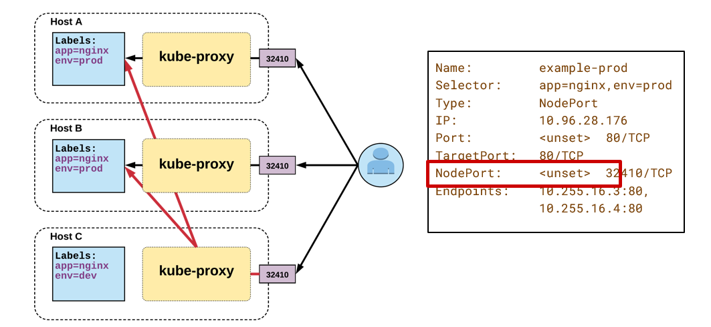
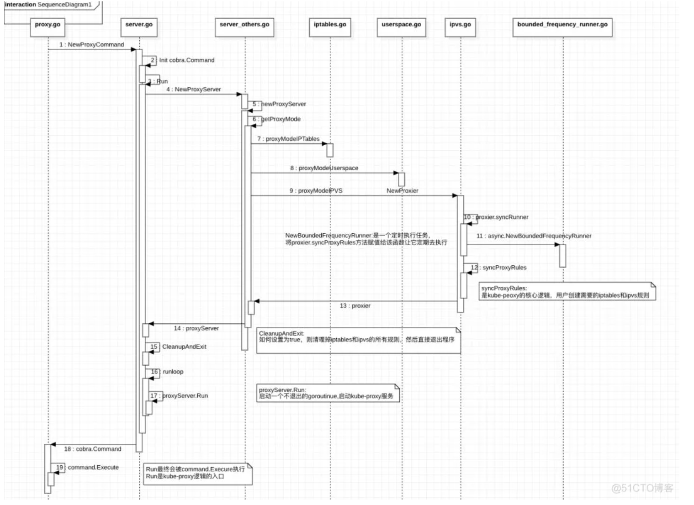

kubeproxy工作：

–K8s会为Service分配一个“持久化的”集群内的IP

–通过**kube-proxy** 实现Pod和Service之间的通信/调用

–Service的IP是持久化的，就是Service对应的Pod挂了也不会变

kube-proxy 的主要作用是watch apiserver，当监听到pod 或service变化时，修改本地的iptables规则或ipvs规则。

service流程：

- K8s会为Service分配一个“持久化的”集群内的IP
- kubeproxy维护service ip和转发的实际pod ip的关系
- 

**Node Port** **Service**



service在不同node上开相同的端口，用户以同一端口号访问任意一个node的kube-proxy，kubeproxy负责转发。

**kubeproxy iptable负责维护：**

service ip和转发的实际pod ip的关系


**三种模式：**

**userspace：**在这种模式下，kube-proxy通过观察Kubernetes中service和endpoint对象的变化，当有新的service创建时，所有节点的kube-proxy在node节点上随机选择一个端口，在[iptables](https://so.csdn.net/so/search?q=iptables&spm=1001.2101.3001.7020)中追加一条把访问service的请求重定向到这个端口的记录，并开始监听这个端口的连接请求。

创建一个service,对应的IP：1.2.3.4,port:8888，kube-proxy随机选择的端口是32890，iptable追加：

-A KUBE-PORTALS-CONTAINER -d 1.2.3.4/32 -p tcp --dport 8888 -j REDIRECT --to-ports 32890

**iptables 模式：**

在这种模式下，kube-proxy通过观察Kubernetes中service和endpoint对象的变化，当有servcie创建时，kube-proxy在iptables中追加新的规则。对于service的每一个endpoint，会在iptables中追加一条规则，设定动作为DNAT，将目的地址设置成真正提供服务的pod地址；再为servcie追加规则，设定动作为跳转到对应的endpoint的规则上，

默认情况下，kube-proxy随机选择一个后端的服务，可以通过iptables中的 -m recent 模块实现session affinity功能，通过 -m statistic 模块实现负载均衡时的权重功能

比如说创建了一个service，对应的IP：1.2.3.4,port:8888，对应一个后端地址：10.1.0.8:8080，则会在iptables中追加（主要规则）：

```css
 -A PREROUTING -j KUBE-SERVICES
 
-A KUBE-SERVICES -d 1.2.3.4/32 -p tcp –dport 8888 -j KUBE-SVC-XXXXXXXXXXXXXXXX
 
-A KUBE-SVC-XXXXXXXXXXXXXXXX -j KUBE-SEP-XXXXXXXXXXXXXXXX
 
-A KUBE-SEP-XXXXXXXXXXXXXXXX -p tcp -j DNAT –to-destination 10.1.0.8:8080

```

直接查询到对应pod的cluster ip + 端口

测试方法：创建一个serevice，创建一个client pod，client pod给service发请求

**ipvs模式：**

kube-proxy 依然监听Service以及Endpoints对象的变化, 不过它并不创建反向代理, 也不创建大量的 iptables 规则, 而是通过netlink 创建ipvs规则，并使用k8s Service与Endpoints信息，对所在节点的ipvs规则进行定期同步; netlink 与 iptables 底层都是基于 netfilter 钩子，但是 netlink 由于采用了 hash table 而且直接工作在内核态，在性能上比 iptables 更优。


**ipvsadm运行在用户态，提供简单的CLI接口进行ipvs配置。**

由于ipvs工作在内核态，直接基于内核处理包转发，所以最大的特点就是性能非常好。


ipvs模式下 kubeproxy工作：

简单来说kube-proxy主要在所有的Node节点做如下三件事:

1. 如果没有dummy类型虚拟网卡，则创建一个，默认名称为`kube-ipvs0`;
2. 把Kubernetes ClusterIP地址添加到`kube-ipvs0`，同时添加到ipset中。
3. 创建ipvs service，ipvs service地址为ClusterIP以及Cluster Port，ipvs server为所有的Endpoint地址，即Pod IP及端口。

#### K8s中的kube-proxy实现

这里重点是 **[proxier 对象实例化](*[https://github.com/kubernetes/kubernetes/blob/v1.18.2/cmd/kube-proxy/app/server_others.go#L307-L336](https://link.zhihu.com/?target=https%3A//github.com/kubernetes/kubernetes/blob/v1.18.2/cmd/kube-proxy/app/server_others.go%23L307-L336)*)** ，它会调用 ipvs 包的 **[实例化逻辑](*[https://github.com/kubernetes/kubernetes/blob/v1.18.2/pkg/proxy/ipvs/proxier.go#L319-L482](https://link.zhihu.com/?target=https%3A//github.com/kubernetes/kubernetes/blob/v1.18.2/pkg/proxy/ipvs/proxier.go%23L319-L482)*)** ，

\* **[syncProxyRules() 函数](*[https://github.com/kubernetes/kubernetes/blob/v1.18.2/pkg/proxy/ipvs/proxier.go#L989-L1626](https://link.zhihu.com/?target=https%3A//github.com/kubernetes/kubernetes/blob/v1.18.2/pkg/proxy/ipvs/proxier.go%23L989-L1626)*)** 这六百多行代码是整个 kube-proxy 模块的最核心的逻辑，会把用户创建的 service 转换为 ipvs rules，然后调用 **[ipvs go 客户端](*[https://github.com/kubernetes/kubernetes/blob/v1.18.2/pkg/util/ipvs/ipvs.go](https://link.zhihu.com/?target=https%3A//github.com/kubernetes/kubernetes/blob/v1.18.2/pkg/util/ipvs/ipvs.go)*)** 写入内核中。
这里会根据每一个 service 去构建 **[ipvs rules](*[https://github.com/kubernetes/kubernetes/blob/v1.18.2/pkg/proxy/ipvs/proxier.go#L1115-L1540](https://link.zhihu.com/?target=https%3A//github.com/kubernetes/kubernetes/blob/v1.18.2/pkg/proxy/ipvs/proxier.go%23L1115-L1540)*)** 。



写flannel的虚拟ip是不是就能找到

得到一个service 的虚拟ip，加入一条规则，实现service ip -> pod ip映射。这里的pod ip是不是是虚拟的flannel ip就行？

？谁来为service分配虚拟ip

### 环境配置

1. 下载ipvsadm，便于调试

`apt install ipvsadm`

1. 打开ipvs的conntrack

```undefined
sysctl net.ipv4.vs.conntrack=1
```

2. 添加一个虚拟ip

```csharp
ipvsadm -A -t 10.10.0.1:8410 -s rr
```

3. 把虚拟ip地址添到本地flannel.1网卡

```csharp
ip addr add 10.10.0.1/24 dev flannel.1
```

4. 为虚拟ip添加end point（真正提供服务的节点）

```cpp
ipvsadm -a -t 10.10.0.1:8410 -r 10.2.17.53:12345 -m
```

5. 添加SNAT功能

```shell
iptables -t nat -A POSTROUTING -m ipvs  --vaddr 10.10.0.1 --vport 8410 -j MASQUERADE
```

删除命令：`ipvsadm -D -t 10.10.0.1:8410`

查看所有规则：`ipvsadm -Ln`